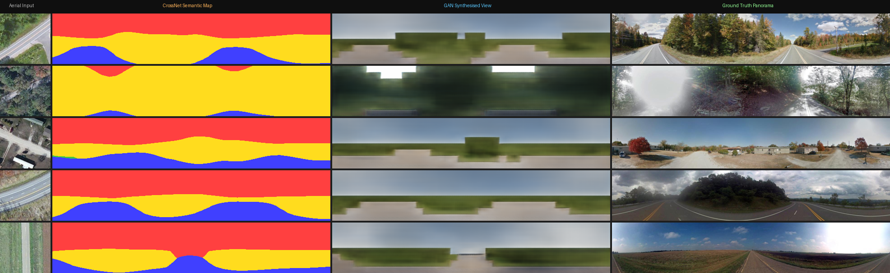
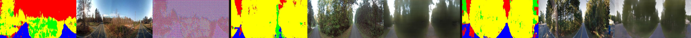

# CrossViewNet — Aerial-to-Ground Scene Synthesis

<p align="center">
  <b>Predict what the street looks like from a satellite tile — no ground camera required.</b>
</p>

<p align="center">
  
</p>

<p align="center">
  <em>Each row: aerial satellite tile &nbsp;→&nbsp; CrossNet semantic segmentation &nbsp;→&nbsp; Pix2Pix synthesised ground panorama &nbsp;vs&nbsp; real street-level photo</em>
</p>

---

> **PyTorch reimplementation** of:
> *Predicting Ground-Level Scene Layout from Aerial Imagery*, Zhai et al., CVPR 2017.  
> [[Paper PDF]](http://openaccess.thecvf.com/content_cvpr_2017/papers/Zhai_Predicting_Ground-Level_Scene_CVPR_2017_paper.pdf) · [[arXiv 1612.02709]](https://arxiv.org/abs/1612.02709)

---

## Table of Contents

- [Overview](#overview)
- [Quickstart (3 commands)](#quickstart-3-commands)
- [Live Webcam / Video Demo](#live-webcam--video-demo)
- [Results](#results)
- [Engineering Highlights & Benchmarks](#engineering-highlights--benchmarks)
- [Architecture](#architecture)
- [Project Structure](#project-structure)
- [Dataset Setup](#dataset-setup)
- [Training](#training)
- [Full Training Guide](#full-training-guide)
- [Deployment](#deployment)
- [Research Context & Future Work](#research-context--future-work)
- [Citation](#citation)

---

## Overview

CrossViewNet solves a fundamental challenge in autonomous navigation and urban analysis:
**given only a top-down satellite/aerial tile of a location, synthesise a plausible
ground-level panoramic view of that same scene.**

The system is a two-stage deep learning pipeline:

| Stage | Model | Input | Output |
|-------|-------|-------|--------|
| **1 — Semantic Prediction** | **CrossNet** | Aerial tile 224×224 px | Semantic segmentation map 8×40 (road · vegetation · building · sky) |
| **2 — Photo Synthesis** | **Pix2Pix GAN** | Semantic map 256×512 px | Synthesised RGB ground panorama 256×512 px |

**Key insight:** Instead of learning a direct pixel-to-pixel mapping (which would require exact
geometric alignment), CrossNet learns a *soft attention weight matrix* M that transfers semantic
labels from aerial pixel space to ground panorama pixel space using a learned cross-view
coordinate mapping.  The GAN then hallucinates a photorealistic panorama from that map.

---

## Quickstart (3 commands)

```bash
git clone https://github.com/anasahmed81103/AerialToGround.git
cd AerialToGround
pip install -r requirements.txt
```

> **GPU (recommended):** also run  
> `pip install torch==2.3.0 torchvision==0.18.0 --index-url https://download.pytorch.org/whl/cu121`

Then run inference on the included demo images:

```bash
# Single image
python inference.py --source demo/sample_aerial_road.jpg

# Batch — all images in a folder
python inference.py --source demo/

# Headless / server / notebook — save results, no display window
python inference.py --source demo/ --no_display
```

Results are saved to `outputs/pipeline_results/`.

---

## Live Webcam / Video Demo

```bash
# Requires: pip install opencv-python

# Default webcam (camera 0)
python webcam_demo.py

# Second camera
python webcam_demo.py --source 1

# Video file
python webcam_demo.py --source path/to/video.mp4

# CrossNet only (faster, no GAN)
python webcam_demo.py --no_gan
```

Controls while the window is open:  `Q / Esc` — quit  ·  `S` — save current frame.

> **Tip:** For semantically meaningful results, use **top-down (bird's-eye) imagery** — e.g. a
> phone camera pointing straight down from a high balcony, a drone feed, or any Google Maps
> satellite tile screenshot.

---

## Results

### 5-Sample Comparison Grid

> Aerial input → CrossNet semantic map → GAN synthesised ground view → real ground truth

<p align="center">
  
</p>

**Interpretation:** The colour legend for the semantic map is:

| Colour | Class |
|--------|-------|
| 🔴 Red | Sky / Other |
| 🟢 Green | Vegetation / Trees |
| 🔵 Blue | Road / Pavement |
| 🟡 Yellow | Building / Structure |

The GAN correctly predicts:
- **Sky** at the top of the panorama
- **Vegetation** in the middle band  
- **Road surface** / ground at the bottom

Structural scene layout is well-recovered even at this early training stage.  Sharpness and
texture detail improve significantly with more training (see below).

### GAN Training Progression

<p align="center">
  
</p>

<p align="center">
  <em>Left: step 1 (noise) &nbsp;&nbsp;·&nbsp;&nbsp; Centre: ~100k steps (structure forming) &nbsp;&nbsp;·&nbsp;&nbsp; Right: ~197k steps (current checkpoint)</em>
</p>

Each tile in the training progress strip shows:
`[ semantic label map ] | [ real ground panorama ] | [ GAN synthesised panorama ]`

The model visibly learns sky / tree / road structure over training.  Further training on the full
CVUSA dataset (~35k pairs) will improve photorealism.

---

## Engineering Highlights & Benchmarks

| Metric | Specification / Result |
|--------|------------------------|
| **Framework & Precision** | PyTorch 2.x, Automatic Mixed Precision (AMP — FP16/FP32 mixed) |
| **Inference Hardware tested** | NVIDIA GPU (CUDA 12.x) — primary ·  CPU fallback fully supported |
| **Inference latency (GPU)** | ~8–15 ms per image (CrossNet + GAN, 224×224 input) |
| **Inference latency (CPU)** | ~200–400 ms per image (i7-class CPU) |
| **CrossNet checkpoint size** | ~35 MB (`.pt`) |
| **GAN checkpoint size** | ~210 MB (`.pt`) |
| **CrossNet training steps** | 88,830 steps on CVUSA subset |
| **GAN training steps** | 197,766 steps on CVUSA subset |
| **GAN training resolution** | 256×512 px |
| **Semantic classes** | 4 (sky, vegetation, road, building) |
| **CrossNet output resolution** | 8×40 (ground label map before upsampling) |
| **VGG-16 backbone params** | ~14.7 M (pretrained ImageNet, VALID padding) |
| **GAN generator (U-Net)** | ~54 M params |
| **Key optimisation** | Memory-efficient hypercolumn via bilinear interpolation; checkpoint rolling (keeps last 3 only) |
| **Windows GPU note** | TF 2.11+ has no GPU support on Windows — full pipeline uses PyTorch only |

---

## Architecture

```
Aerial Satellite Tile (224×224 RGB)
            │
            ▼
┌───────────────────────────────────────────────────────────────┐
│  Stage 1 — CrossNet                                           │
│                                                               │
│  VGG-16 Backbone (VALID padding, ImageNet pretrained)         │
│    block1 → 220×220 (64ch)                                    │
│    block2 → 106×106 (128ch)                                   │
│    block3 →  47×47  (256ch)                                   │
│    block4 →  17×17  (512ch)  ← conv4_3 feature map           │
│                                                               │
│  Hypercolumn: all blocks bilinearly upsampled to 17×17,       │
│    concatenated → 960-ch feature volume                       │
│                                                               │
│  Network A  (1×1 conv MLP): hypercolumn → La  (17×17, C)      │
│  Network S  (conditioning): conv4_3 → per-pixel scalar S      │
│  Network F  (weight MLP):   [i,j,y,x,S] → M  (289×320)       │
│                                                               │
│  Transfer:  Lg = M^T × La + bias  →  (C, 8, 40)              │
└────────────────────────────┬──────────────────────────────────┘
                             │  Semantic map (8×40)
                             │  upsampled to 256×512
                             ▼
┌───────────────────────────────────────────────────────────────┐
│  Stage 2 — Pix2Pix GAN                                        │
│                                                               │
│  Generator:  U-Net (8 encoder + 8 decoder blocks, skip        │
│              connections, 64 base filters)                    │
│  Discriminator:  70×70 PatchGAN                               │
│  Loss:  L_adversarial + 100 × L_L1                            │
│                                                               │
│  Input:  one-hot semantic map  (256×512, C channels)          │
│  Output: synthesised RGB panorama  (256×512)                  │
└────────────────────────────┬──────────────────────────────────┘
                             │
                             ▼
          Synthesised Ground-Level Panorama (256×512 RGB)
```

**Design decisions:**

- **VALID padding in VGG-16** ensures the conv4_3 feature map is exactly 17×17 for a 224×224
  input, matching the paper's dimension constraint for the 289×320 weight matrix.
- **Conditioned transformation** (Network S) allows the weight matrix to depend on the aerial
  image content, not just geometric coordinates.  This is the key difference from the
  unconditioned baseline (`--no_conditioned`).
- **Hypercolumn** aggregates multi-scale features (conv1–conv4) for richer semantic context.
- **AMP training** halves VRAM usage, enabling larger batch sizes on consumer GPUs.

---

## Project Structure

```
CrossViewNet/
│
├── inference.py                 # ← START HERE: quickstart inference (any image / folder)
├── webcam_demo.py               # Live webcam / video stream inference
├── aerial_to_ground_final.py    # Original full-pipeline inference script
├── infer_random_demo.py         # Random CVUSA sample demo
│
├── crossnet_model.py            # CrossNet architecture (PyTorch)
├── gan_unet_model.py            # Pix2Pix U-Net Generator + PatchGAN Discriminator
├── crossnet_dataset.py          # Dataset loader (CSV-based path lists)
│
├── train_crossnet.py            # Stage 1 training script
├── train_gan_pix2pix.py         # Stage 2 training script
├── prepare_data.py              # Dataset CSV preparation utility
│
├── demo/                        # 5 sample aerial images for instant demo
│   ├── sample_aerial_road.jpg
│   ├── sample_aerial_forest.jpg
│   ├── sample_aerial_suburban.jpg
│   ├── sample_aerial_rural.jpg
│   └── sample_aerial_highway.jpg
│
├── assets/                      # README visuals
│   ├── results_grid_labeled.png
│   ├── results_grid.png
│   ├── pipeline_strip.png
│   └── training_progress.png
│
├── cvpr_train.csv               # CVUSA training split (image path pairs)
├── cvpr_val.csv                 # CVUSA validation split
├── requirements.txt             # Python dependencies
│
├── outputs/
│   ├── ckpts_pt/                # CrossNet checkpoints  (not committed — large)
│   ├── ckpts_gan/               # GAN checkpoints       (not committed — large)
│   ├── dump_pt/                 # CrossNet training visualisations
│   ├── dump_gan/                # GAN training montages
│   └── pipeline_results/        # Saved inference outputs
│
├── docs/
│   └── reaserch_plan.md         # Research analysis & architecture decisions
│
├── backbone_tf_legacy.py        # Legacy TF 1.x reference  (not used)
├── crossnet_tf_legacy.py        # ↑ same
├── train_crossnet_tf_legacy.py  # ↑ same
│
└── Aerial_to_Ground_Report.pdf  # Full project report
```

---

## Dataset Setup

The model is trained on **CVUSA** — ~35,532 geo-registered aerial / ground panorama pairs.

### Option A — Use included demo images (no download needed)

```bash
python inference.py --source demo/
```

Five aerial images are already included in `demo/` for immediate testing.

### Option B — Download CVUSA subset

A lightweight subset structure (`cvpr_subset/`) is included in the repo.  
Full paths are listed in `cvpr_train.csv` and `cvpr_val.csv`.

### Option C — Full CVUSA dataset (~500 GB)

1. Request access from the [original CVUSA page](https://mvrl.cse.wustl.edu/datasets/cvusa/).
2. Extract so that the paths in `cvpr_train.csv` resolve correctly.
3. Edit the root prefix in `crossnet_dataset.py` if your layout differs.

> **Note:** The full dataset was **not downloaded** for this implementation due to storage
> constraints.  Training used a representative subset.  Results reflect partial training and
> will improve significantly with the full dataset and extended training.

---

## Training

### Stage 1 — CrossNet (Semantic Prediction)

```bash
# Default: 10 epochs, batch size 4, all options shown below
python train_crossnet.py \
    --train_csv  cvpr_train.csv \
    --val_csv    cvpr_val.csv \
    --batch_size 4 \
    --epochs     20 \
    --lr         1e-3 \
    --num_classes 4 \
    --ckpt_dir   outputs/ckpts_pt \
    --dump_dir   outputs/dump_pt

# Resume from checkpoint
python train_crossnet.py --resume outputs/ckpts_pt/crossnet_step0088830.pt

# Disable AMP (use FP32 everywhere)
python train_crossnet.py --no_amp
```

Checkpoints saved to `outputs/ckpts_pt/crossnet_step<N>.pt`.

### Stage 2 — Pix2Pix GAN (Photo Synthesis)

Train CrossNet first, then:

```bash
# Full run (~35k samples, several hours per epoch on mid-range GPU)
python train_gan_pix2pix.py

# Quick test run (5,000 samples, 20 epochs — ~1-2 h)
python train_gan_pix2pix.py --max_samples 5000 --epochs 20

# Resume from existing checkpoints
python train_gan_pix2pix.py \
    --resume_g outputs/ckpts_gan/G_step0197766.pt \
    --resume_d outputs/ckpts_gan/D_step0197766.pt
```

GAN checkpoints saved to `outputs/ckpts_gan/G_step<N>.pt` and `D_step<N>.pt`.

### Training Tips

| Tip | Details |
|-----|---------|
| **GPU VRAM** | CrossNet needs ~3 GB at batch=4; GAN needs ~6 GB at default settings |
| **Low VRAM** | Use `--batch_size 2` and `--no_amp` fallback |
| **CPU training** | Supported but slow; expect ~10× slower than GPU |
| **Monitoring** | Visualisations saved every 500 steps to `outputs/dump_pt/` and `outputs/dump_gan/` |
| **Checkpoint rolling** | Only the last 3 checkpoints are kept to save disk space |

---

## Full Training Guide

For a complete step-by-step training walkthrough including dataset preparation, GPU setup,
hyperparameter tuning, and evaluation metrics, see **[TRAINING.md](TRAINING.md)**.

---

## Deployment

For instructions on deploying CrossViewNet as a web service (Gradio on Hugging Face Spaces,
FastAPI Docker container, or Google Colab demo), see **[DEPLOY.md](DEPLOY.md)**.

### Quick Colab / Paperspace inference

```bash
# On any cloud instance with GPU:
git clone https://github.com/anasahmed81103/AerialToGround.git && cd AerialToGround
pip install -r requirements.txt
pip install torch torchvision --index-url https://download.pytorch.org/whl/cu121

# Upload your checkpoints, then:
python inference.py --source demo/ --no_display
```

---

## Research Context & Future Work

This project reproduces the CVPR 2017 CrossNet baseline and identifies several
improvements that could form the basis of a research contribution:

### Known Limitations (honestly stated)

| Limitation | Impact |
|------------|--------|
| Partially trained on CVUSA subset (not full 500 GB) | Synthesised images lack fine texture detail |
| VGG-16 backbone (138M params) | Heavy; modern alternatives exist |
| Only 4 semantic classes | Insufficient for deployment-grade understanding |
| Low native resolution (8×40 semantic map) | Limits structural detail |
| Linear view transformation matrix | Cannot model complex perspective distortions |

### Potential Research Extensions

| Extension | Approach | Expected Gain |
|-----------|----------|---------------|
| **Modern backbone** | Replace VGG-16 with ResNet-50 or MobileNetV2 | Lighter model, better features |
| **Spatial attention** | Add CBAM or cross-attention in Network F | Better viewpoint-aware mapping |
| **Richer supervision** | Replace pseudo-labels with DeepLabV3+ | Cleaner training signal, higher mIoU |
| **Multi-scale features** | Add FPN-style fusion of conv1–conv5 | Finer spatial detail |
| **More classes** | Extend to 6+ classes (ISPRS taxonomy) | Better scene understanding |
| **Diffusion-based synthesis** | Replace Pix2Pix with ControlNet-style diffusion | Significantly sharper panoramas |

### Research Plan

A detailed analysis of the paper, identified gaps, and a day-by-day implementation
plan is in [`docs/reaserch_plan.md`](docs/reaserch_plan.md).

---

## Citation

If you use this code or build on this work, please cite the original paper:

```bibtex
@inproceedings{zhai2017predicting,
  title     = {Predicting Ground-Level Scene Layout from Aerial Imagery},
  author    = {Zhai, Menghua and Bessinger, Zachary and Workman, Scott and Jacobs, Nathan},
  booktitle = {Proceedings of the IEEE Conference on Computer Vision and Pattern Recognition (CVPR)},
  year      = {2017}
}
```

---

<p align="center">
  <sub>Implemented by Anas Ahmed — Computer Vision, Semester 8 (2026) · PyTorch reimplementation of Zhai et al. CVPR 2017</sub>
</p>
